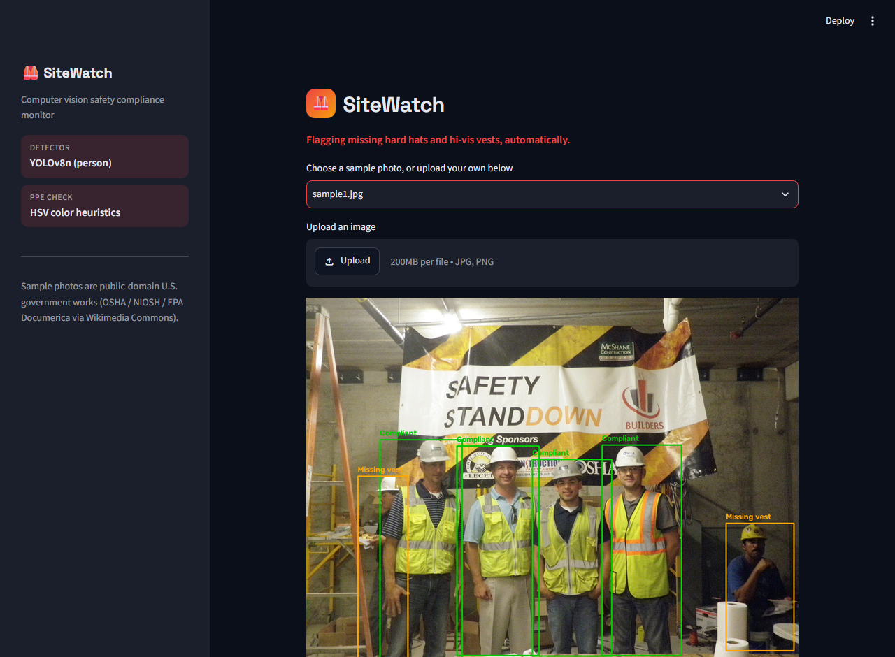

# 🦺 SiteWatch

**A computer vision safety compliance monitor — detects people in a photo and flags whether each is wearing a hard hat and high-visibility vest.**




## What it does

SiteWatch scans a photo, finds every person in it, and checks whether each one is wearing a hard hat and a high-visibility vest — flagging exactly who is and isn't compliant. This is the class of problem behind real industrial safety-monitoring systems: organizations that operate job sites or facilities at scale — construction, energy, utilities, manufacturing — use automated PPE compliance checks like this to catch violations that a supervisor walking the floor could easily miss.

## How it works — and why, honestly

1. **Person detection** ([ppe_monitor.py](ppe_monitor.py)) — a pretrained **YOLOv8n** model (trained on COCO, used off-the-shelf with no fine-tuning) finds every person in the frame.
2. **PPE heuristics** — for each detected person, the head and torso regions of their bounding box are checked in HSV color space for hard-hat colors (yellow, orange, red, blue, white) and high-visibility vest colors (hi-vis yellow-green, hi-vis orange).

This is a deliberate, disclosed tradeoff: **there's no labeled PPE training dataset here, and no custom-trained classifier.** Detecting *people* reliably needs a real object detector (hence YOLOv8), but flagging *hard hats and vests* is done with color heuristics rather than a trained model — it's a fast, dependency-light proof of concept, not a production-grade learned PPE detector. A real deployment would fine-tune a detector on labeled PPE images (bounding boxes for helmets/vests specifically) to handle occlusion, unusual poses, and non-standard PPE colors far more robustly. The tradeoffs are visible in the demo: it does noticeably better on standing, front-facing people than on seated or turned-away ones.

## Limitations & future improvements

- **No safety glasses / eye protection detection.** Hard hats and hi-vis vests work well with color heuristics because they're large, solid-colored regions. Safety glasses are small, often clear or lightly tinted, and sit on a face full of confounding colors (skin, hair, shadows) — a color threshold would produce unreliable results rather than a useful signal. Adding this properly would need a trained object detector on labeled eyewear data, not a heuristic.
- **Pose-sensitive.** The head/torso region split assumes a roughly upright, front-or-side-facing person. Seated, crouched, or heavily occluded people (see the seated worker in the demo, flagged incorrectly) throw off the region boundaries.
- **Color-based, not shape-based.** Anything coincidentally matching hi-vis or hard-hat hues (e.g. a yellow jacket) can register as compliant even if it isn't actually PPE — a trained classifier would be far more robust here.

## Sample images

The bundled sample photos in [samples/](samples/) are all U.S. federal government works and in the **public domain** — no licensing concerns, sourced via Wikimedia Commons:

| File | Source | Agency |
|---|---|---|
| `sample1.jpg` | [Wikimedia Commons](https://commons.wikimedia.org/wiki/File:OSHA_Compliance_Officer_Emil_Szotko_(far_right)_with_employees_from_the_McShane_Construction_Company.jpg) | U.S. Department of Labor (OSHA) |
| `sample2.jpg` | [Wikimedia Commons](https://commons.wikimedia.org/wiki/File:CONSTRUCTION_WORKERS_TAKE_LUNCH_BREAK_AT_SITE_OF_EXPO_%2774_SITE_OVERLOOKS_THE_COLUMBIA_RIVER_-_NARA_-_548120.jpg) | EPA / DOCUMERICA (National Archives) |
| `sample3.jpg` | [Wikimedia Commons](https://commons.wikimedia.org/wiki/File:Construction_workers_not_wearing_fall_protection_equipment.jpg) | NIOSH |

You can also upload your own photo directly in the app.

## Tech stack

| Layer | Tool |
|---|---|
| Person detection | Ultralytics YOLOv8n (pretrained on COCO) |
| PPE heuristics | OpenCV (HSV color thresholding) |
| UI | Streamlit |

## Setup

```bash
pip install -r requirements.txt
streamlit run app.py
```

The YOLOv8n weights (~6 MB) download automatically on first run.

## License

MIT for this project's code — see [LICENSE](LICENSE). Note that the Ultralytics YOLOv8 dependency is licensed separately under AGPL-3.0, and the bundled sample images are U.S. government works in the public domain (see table above).
